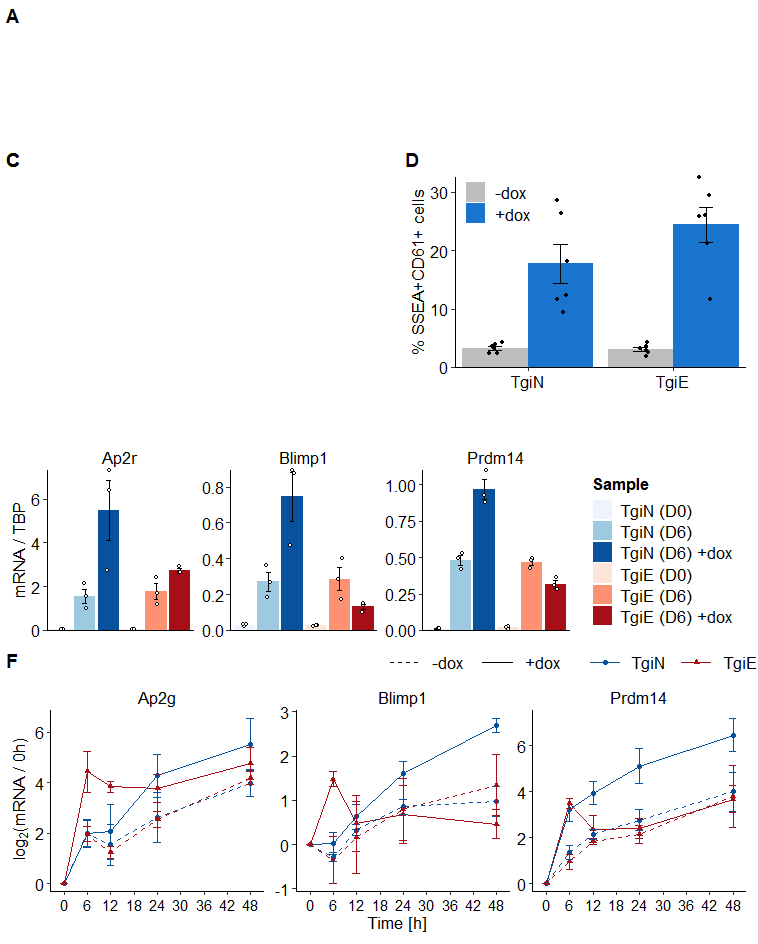
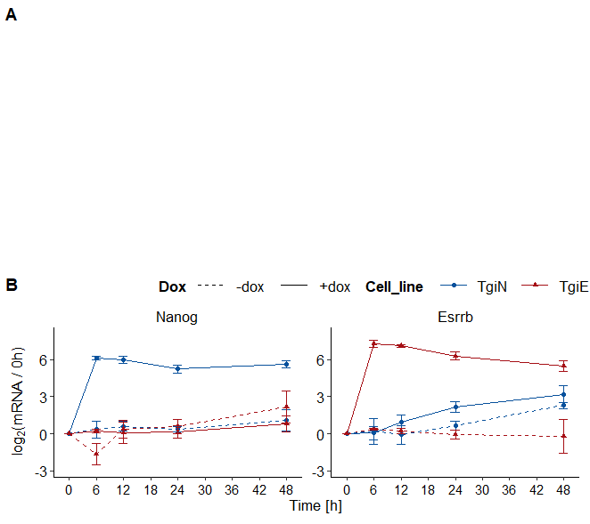
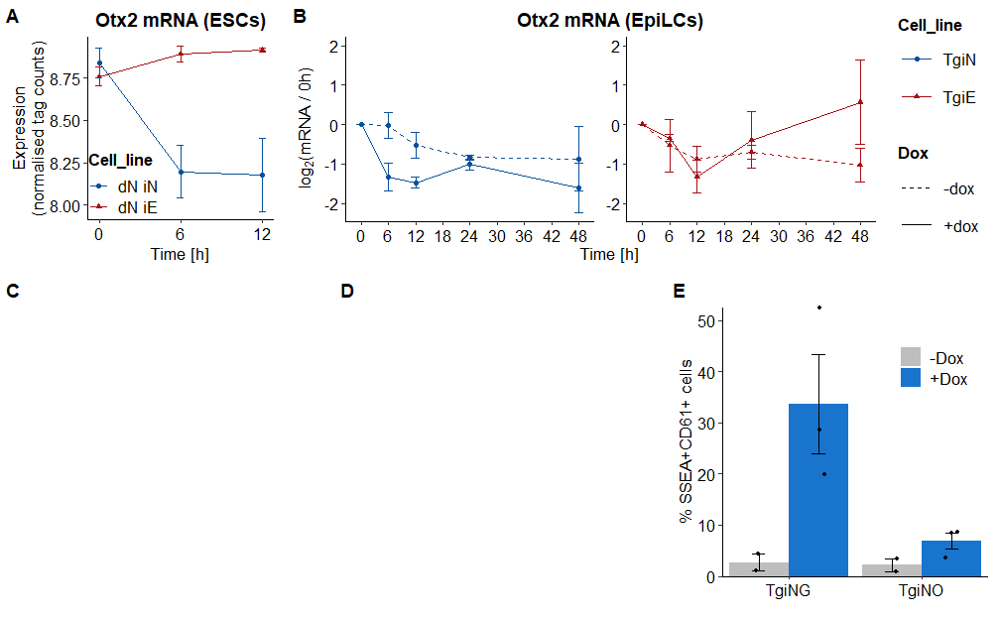
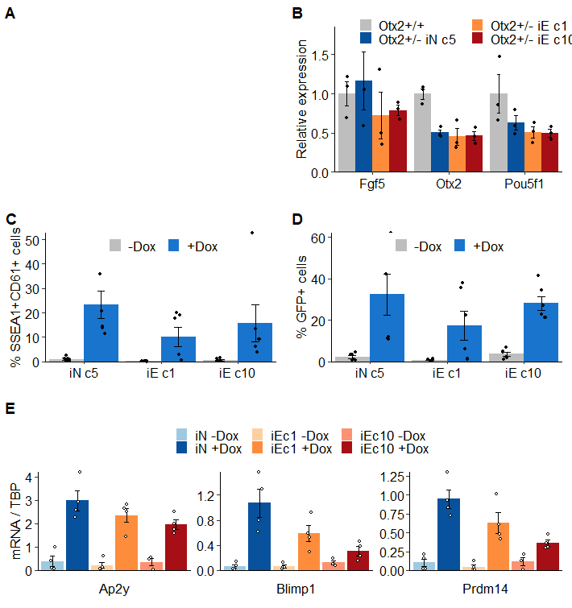
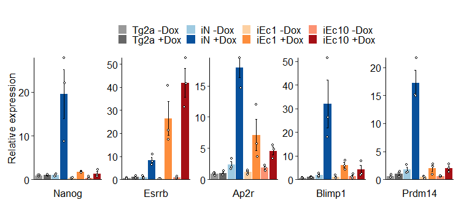

## Differential repression of Otx2 underlies the capacity of NANOG and ESRRB to induce germline entry (Supplementary analysis code)

***Matúš Vojtek, Jingchao Zhang, Juanjuan Sun, Man Zhang and Ian
Chambers***

[10.1016/j.stemcr.2021.11.013](https://doi.org/10.1016/j.stemcr.2021.11.013)

------------------------------------------------------------------------

This is a code to reproduce analysis and figures in the manuscript. You
can download the data and the code for the analysis either by clicking
[here](https://github.com/MatusV8/Otx2het/archive/refs/heads/main.zip),
or via bash command line

`git clone https://github.com/MatusV8/Otx2het.git` and reproduce the
analysis on your local machine.

The code to reproduce the figures can be seen below.

## Folder structure

-   ***Data/*** - all data required for analysis.
-   ***Fig/*** - folder where the figures will be saved.
-   ***src/*** - Custom R functions.
-   ***Analysis.Rmd*** - Rmarkdown file which contains all code required
    for the analysis.

## Table of contents

-   [Setup](#setup)
-   [Figure 1](#figure-1)
    -   [Figure 1D: Effect of Nanog or Esrrb induction on SSEA1, CD61
        expression](#figure-1d-effect-of-nanog-or-esrrb-induction-on-ssea1-cd61-expression)
    -   [Figure 1E: Effect of Nanog or Esrrb induction on expression of
        PGC markers
        (day 6)](#figure-1e-effect-of-nanog-or-esrrb-induction-on-expression-of-pgc-markers-day-6)
    -   [Figure 1F: Effect of Nanog or Esrrb induction on expression of
        PGC markers (day
        0-2)](#figure-1f-effect-of-nanog-or-esrrb-induction-on-expression-of-pgc-markers-day-0-2)
    -   [Composite figure](#composite-figure)
-   [Figure S1B: Induction levels of *Nanog* and *Esrrb* in TgiN, TgiE
    cells](#figure-s1b-induction-levels-of-nanog-and-esrrb-in-tgin-tgie-cells)
-   [Figure 2](#figure-2)
    -   [Figure 2A: *Otx2* expression after Nanog or Esrrb induction
        (Festuccia et
        al. 2012)](#figure-2a-otx2-expression-after-nanog-or-esrrb-induction-festuccia-et-al-2012)
    -   [Figure 2B: *Otx2* expression after Nanog or Esrrb induction in
        EpiLCs](#figure-2b-otx2-expression-after-nanog-or-esrrb-induction-in-epilcs)
    -   [Figure 2E: SSEA1 and CD61 induction in TgiN and TgiNO
        cells](#figure-2e-ssea1-and-cd61-induction-in-tgin-and-tgino-cells)
    -   [Composite figures](#composite-figures)
-   [Figure S2: Induction levels of *Nanog* and *Otx2* in TgiNG and
    TgiNO
    cells](#figure-s2-induction-levels-of-nanog-and-otx2-in-tging-and-tgino-cells)
-   [Figure 3](#figure-3)
    -   [Figure 3B: Expression of EpiLC markers in *Otx2<sup>+/-</sup>*
        iN, iE
        EpiLCs](#figure-3b-expression-of-epilc-markers-in-otx2--in-ie-epilcs)
    -   [Figure 3C: Induction of SSEA1 and CD61 in *Otx2<sup>+/-</sup>*
        cells](#figure-3c-induction-of-ssea1-and-cd61-in-otx2--cells)
    -   [Figure 3D: Induction of dPE::GFP reporter in
        *Otx2<sup>+/-</sup>*
        cells](#figure-3d-induction-of-dpegfp-reporter-in-otx2--cells)
    -   [Figure 3E: Expression of PGC markers in *Otx2<sup>+/-</sup>*
        iN, iE
        PGCLCs](#figure-3e-expression-of-pgc-markers-in-otx2--in-ie-pgclcs)
    -   [Composite figures](#composite-figures-1)
-   [Figure S3: Expression at day 2 of PGCLC differentiation
    (*Otx2<sup>+/-</sup>*
    cells)](#figure-s3-expression-at-day-2-of-pgclc-differentiation-otx2--cells)
-   [Session info](#session-info)


## Setup

``` r
require(readr)
require(dplyr)
require(tidyr)
require(ggplot2)
require(RColorBrewer)
require(cowplot)
require(rstatix)
require(ggpubr)

# Set ggplot2 theme
theme_set(theme_classic() +      # Font size 12
            theme(panel.grid.major = element_blank(), # No major grid
                  panel.grid.minor = element_blank(), # No minor grid
                  strip.background = element_blank(), # Remove background
                  legend.key = element_blank(), # Remove White box around legend
                  plot.title = element_text(hjust = 0.5, # Center title
                                            face = "bold",
                                            size = 14), # Title bold
                  plot.subtitle = element_text(hjust = 0.5), # Center subtitle
                  plot.margin = margin(t = 3, r = 3, # Set margins around plots
                                       b = 3, l = 3,
                                       unit = "mm"),
                  legend.key.size = unit(5.6, "mm"),
                  axis.text = element_text(size = 12,
                                           color = "black"),
                  axis.title = element_text(size = 13,
                                            color = "black"),
                  strip.text.x = element_text(size = 13,
                                              color = "black"),
                  legend.text = element_text(size = 13,
                                             color = "black"),
                  legend.title = element_text(size = 13,
                                              color = "black",
                                              face = "bold"), # Size of legend key
                  legend.background= element_blank() # remove background
            ))

# Create colour palettes
Blues_pal6 <- brewer.pal(6, "Blues")
Reds_pal6 <- brewer.pal(6, "Reds")
Oranges_pal6 <- brewer.pal(6, "Oranges")
Purples_pal6 <- brewer.pal(6, "Purples")
Dox_cols <- c("gray", "dodgerblue3")

BlueRed_pal6 <- c(Blues_pal6[c(1,3,6)],
                  Reds_pal6[c(1,3,6)])

BlueOrangeRed_pal2 <- c(Blues_pal6[c(3,6)],
                        Oranges_pal6[c(2,4)],
                        Reds_pal6[c(3,6)])

# Import functions
source("src/bargraph_jitter.R")
source("src/bargraph_jitterdodge.R")

# Create output directory for figures
dir.create("Fig")
```

## Figure 1

### Figure 1D: Effect of Nanog or Esrrb induction on SSEA1, CD61 expression

``` r
# load data
TgiNiE_PGCLC_D6 <- read_csv("Data/TgiNiE_PGCLC_D6_SSEA1_CD61.csv")

# Calculate statistics
TgiNiE_PGCLC_D6.stats <- TgiNiE_PGCLC_D6 %>%
  separate(Sample, into = c("Cell_line", "Dox"),
           sep = " ") %>%
  mutate(Cell_line = factor(Cell_line, c("TgiN", "TgiE"))) %>%
  group_by(Cell_line) %>%
  t_test(Dbl_pos ~ Dox, ref.group = "-dox", p.adjust.method = "none") %>% 
  adjust_pvalue(method ="fdr") %>%
  add_significance() %>%
  add_xy_position() %>%
  mutate(xmin = c(0.8, 1.8),
         xmax = c(1.2, 2.2))
TgiNiE_PGCLC_D6.stats
```

    ## # A tibble: 2 × 15
    ##   Cell_line .y.     group1 group2    n1    n2 statistic    df        p   p.adj
    ##   <fct>     <chr>   <chr>  <chr>  <int> <int>     <dbl> <dbl>    <dbl>   <dbl>
    ## 1 TgiN      Dbl_pos -dox   +dox       6     6     -4.35  5.09 0.00708  0.00708
    ## 2 TgiE      Dbl_pos -dox   +dox       6     6     -7.14  5.13 0.000753 0.00151
    ## # … with 5 more variables: p.adj.signif <chr>, y.position <dbl>,
    ## #   groups <named list>, xmin <dbl>, xmax <dbl>

``` r
# Generate plot
TgiNiE_PGCLC_D6.p <- TgiNiE_PGCLC_D6 %>%
  separate(Sample, into = c("Cell_line", "Dox"),
           sep = " ") %>%
  mutate(Cell_line = factor(Cell_line, c("TgiN", "TgiE"))) %>%
  bargraph_jitterdodge(x = Cell_line,
                       y = Dbl_pos,
                       group = Dox,
                       ylab = "% SSEA+CD61+ cells",
                       fill_colors = Dox_cols) +
  guides(fill = guide_legend(
    override.aes = list(shape = NA))) +
  labs(fill = element_blank()) +
  theme(legend.position = "top",
        legend.direction = "horizontal") +
    stat_pvalue_manual(TgiNiE_PGCLC_D6.stats,
                       label = "p.adj.signif",
                       tip.length = 0)
```

### Figure 1E: Effect of Nanog or Esrrb induction on expression of PGC markers (day 6)

``` r
# Load data
TgiNiE_qPCR_D6 <- read_csv("Data/TgiNiE_PGCLC_D6_qPCR.csv")

# Calculate statistics
TgiNiE_qPCR_D6.stats <- TgiNiE_qPCR_D6 %>%
  pivot_longer(cols = Blimp1:Esrrb,
               names_to = "Gene",
               values_to = "Expression") %>%
  filter(Gene %in% c("Ap2r", "Blimp1", "Prdm14")) %>%
  separate(Sample, into = c("Cell_line", "Day", "Dox") ) %>%
  filter(Day == "D6") %>%
  group_by(Gene, Cell_line) %>%
  t_test(Expression ~ Dox, ref.group = "", p.adjust.method = "none") %>% 
  adjust_pvalue(method ="fdr") %>%
  add_significance() %>%
  add_xy_position(scales = "free") %>%
  mutate(xmin = rep(c(5, 2), 3),
         xmax = rep(c(6, 3),3))

TgiNiE_qPCR_D6.stats
```

    ## # A tibble: 6 × 16
    ##   Cell_line Gene   .y.   group1 group2    n1    n2 statistic    df       p  p.adj
    ##   <chr>     <chr>  <chr> <chr>  <chr>  <int> <int>     <dbl> <dbl>   <dbl>  <dbl>
    ## 1 TgiE      Ap2r   Expr… ""     dox        3     3     -2.58  2.30 0.107   0.128 
    ## 2 TgiN      Ap2r   Expr… ""     dox        3     3     -2.74  2.22 0.0991  0.128 
    ## 3 TgiE      Blimp1 Expr… ""     dox        3     3      2.32  2.21 0.134   0.134 
    ## 4 TgiN      Blimp1 Expr… ""     dox        3     3     -3.25  2.57 0.059   0.118 
    ## 5 TgiE      Prdm14 Expr… ""     dox        3     3      4.52  3.84 0.0116  0.0348
    ## 6 TgiN      Prdm14 Expr… ""     dox        3     3     -6.61  2.94 0.00749 0.0348
    ## # … with 5 more variables: p.adj.signif <chr>, y.position <dbl>,
    ## #   groups <named list>, xmin <dbl>, xmax <dbl>

``` r
# Create plot
TgiNiE_qPCR_D6.p <- TgiNiE_qPCR_D6 %>%
  pivot_longer(cols = Blimp1:Esrrb,
               names_to = "Gene",
               values_to = "Expression") %>%
  filter(Gene %in% c("Ap2r", "Blimp1", "Prdm14")) %>%
  mutate(Sample = factor(
    Sample,
    levels = c("TgiN (D0)",
               "TgiN (D6)",
               "TgiN (D6) +dox",
               "TgiE (D0)",
               "TgiE (D6)",
               "TgiE (D6) +dox")
  )) %>%
  
  bargraph_jitter(x = Sample,
                  y = Expression,
                  group = Sample,
                  ylab = "mRNA / TBP", 
                  fill_colors = BlueRed_pal6) +
  facet_wrap(~ Gene, scales = "free_y") +
  theme(axis.title.x = element_blank(),
        axis.text.x = element_blank(),
        axis.ticks.x = element_blank()
        ) +
  stat_pvalue_manual(TgiNiE_qPCR_D6.stats, label = "p.adj.signif", hide.ns = T,
                     tip.length = 0,
                     bracket.nudge.y = c(0.01, -0.1))
```

### Figure 1F: Effect of Nanog or Esrrb induction on expression of PGC markers (day 0-2)

``` r
# Load data
TgiNiE_timecourse <- read_csv("Data/TgiNiE_timecourse.csv")

# Calculate stats
TgiNiE_timecourse %>%
  separate(Sample, into = c("Cell_line", "Dox", "Time"), sep = " ") %>%
  pivot_longer(cols = Blimp1:Nanog,
               names_to = "Gene",
               values_to = "Expression") %>%
  pivot_wider(names_from = Time, values_from = Expression) %>%
  group_by(Cell_line, Dox, Gene) %>% 
  mutate(across(`0h`:`48h`, function(x) log2(x/`0h`))) %>% 
  pivot_longer(cols = `0h`:`48h`, names_to = "Time",
               values_to = "Expression" ) %>%
  filter( Gene %in% c("Ap2g", "Blimp1", "Prdm14")) %>%
  mutate(Time = gsub("h", "", Time) %>% as.numeric(),
         Cell_line = factor(
           Cell_line, levels = c("TgiN", "TgiE")))  %>%
  group_by(Cell_line, Gene, Time) %>%
  pairwise_t_test(Expression ~ Dox,
                  ref.group = "-dox",
         p.adjust.method = "none") %>%
  adjust_pvalue(method = "fdr") %>%
  filter(p.adj < 0.05)
```

    ## # A tibble: 10 × 12
    ##    Cell_line Gene    Time .y.        group1 group2    n1    n2        p p.signif
    ##    <fct>     <chr>  <dbl> <chr>      <chr>  <chr>  <int> <int>    <dbl> <chr>   
    ##  1 TgiN      Blimp1    24 Expression -dox   +dox       3     3 0.014    *       
    ##  2 TgiN      Blimp1    48 Expression -dox   +dox       3     3 0.00141  **      
    ##  3 TgiN      Prdm14     6 Expression -dox   +dox       3     3 0.00554  **      
    ##  4 TgiN      Prdm14    12 Expression -dox   +dox       3     3 0.00445  **      
    ##  5 TgiN      Prdm14    24 Expression -dox   +dox       3     3 0.0101   *       
    ##  6 TgiN      Prdm14    48 Expression -dox   +dox       3     3 0.0187   *       
    ##  7 TgiE      Ap2g       6 Expression -dox   +dox       3     3 0.00749  **      
    ##  8 TgiE      Ap2g      12 Expression -dox   +dox       3     3 0.000153 ***     
    ##  9 TgiE      Blimp1     6 Expression -dox   +dox       3     3 0.0048   **      
    ## 10 TgiE      Prdm14     6 Expression -dox   +dox       3     3 0.000363 ***     
    ## # … with 2 more variables: p.adj <dbl>, p.adj.signif <chr>

``` r
# Create plot
TgiNiE_timecourse_PGC.p <- TgiNiE_timecourse %>%
  separate(Sample, into = c("Cell_line", "Dox", "Time"), sep = " ") %>%
  pivot_longer(cols = Blimp1:Nanog,
               names_to = "Gene",
               values_to = "Expression") %>%
  pivot_wider(names_from = Time, values_from = Expression) %>%
  group_by(Cell_line, Dox, Gene) %>% 
  mutate(across(`0h`:`48h`, function(x) log2(x/`0h`))) %>% 
  pivot_longer(cols = `0h`:`48h`, names_to = "Time",
               values_to = "Expression" ) %>%
  filter( Gene %in% c("Ap2g", "Blimp1", "Prdm14")) %>%
  mutate(Time = gsub("h", "", Time) %>% as.numeric(),
         Cell_line = factor(
           Cell_line, levels = c("TgiN", "TgiE"))) %>%
  group_by(Cell_line, Dox, Time, Gene) %>%
  summarise(Mean = mean(Expression),
            SD = sd(Expression)) %>%
  
  ggplot() +
  aes(x = Time, y = Mean,
      group = paste0(Cell_line, Dox),
      color = Cell_line) +
  geom_line(aes( linetype = Dox )) + 
  geom_point(aes(shape = Cell_line)) +
  scale_color_manual(values = BlueRed_pal6[c(3,6)]) +
  scale_linetype_manual(values=c("dashed", "solid")) +
  geom_errorbar(aes(ymin = Mean - SD,
                    ymax = Mean + SD),
                width = 2, size = 0.5) +
  labs(y = expression(log[2] *"(mRNA / 0h)"),
       color = element_blank(),
       shape = element_blank(),
       linetype = element_blank()) +
  scale_x_continuous(name="Time [h]",
                     breaks = seq(0,48,6)) +
  theme(legend.key.size = unit(1, "cm"),
        legend.position = "top",
        legend.justification="right",
        legend.margin=margin(0,0,0,0),
        legend.box.margin=margin(-10,-10,-10,-10),
        axis.text.x = element_text(size = 11)) +
  facet_wrap(~ Gene, nrow = 1, scales = "free")
```

### Composite figure

``` r
f2_patch <- plot_grid(NULL, TgiNiE_PGCLC_D6.p,
                     rel_widths = c(1, 0.9), labels = c("C", "D")) 

plot_grid(NULL, f2_patch, TgiNiE_qPCR_D6.p, TgiNiE_timecourse_PGC.p,
          labels = c("A", "C", "E", "F"),
          nrow = 4, rel_heights  = c(30,  55, 49, 62))
```

<!-- -->

``` r
ggsave("Fig/Figure1.pdf", width = 20, height = 25, units = "cm")
```

## Figure S1B: Induction levels of *Nanog* and *Esrrb* in TgiN, TgiE cells

``` r
# Create timecourse plot
TgiNiE_timecourse_NanogEsrrb.p <- TgiNiE_timecourse %>%
  separate(Sample,
           into = c("Cell_line", "Dox", "Time"),
           sep = " ") %>%
  pivot_longer(cols = Blimp1:Nanog,
               names_to = "Gene",
               values_to = "Expression") %>%
  pivot_wider(names_from = Time,
              values_from = Expression) %>%
  group_by(Cell_line, Dox, Gene) %>% 
  mutate(across(`0h`:`48h`, function(x) log2(x/`0h`))) %>% 
  pivot_longer(cols = `0h`:`48h`, names_to = "Time",
               values_to = "Expression" ) %>%
  filter( Gene %in% c("Nanog", "Esrrb")) %>%
  mutate(Time = gsub("h", "", Time) %>% as.numeric(),
         Cell_line = factor(Cell_line, levels = c("TgiN", "TgiE")),
         Gene = factor(Gene, levels = c("Nanog", "Esrrb"))) %>%
  group_by(Cell_line, Dox, Time, Gene) %>%
  summarise(Mean = mean(Expression),
            SD = sd(Expression)) %>%
  ggplot() +
  aes(x = Time, y = Mean,
      group = paste0(Cell_line, Dox),
      color = Cell_line) +
  geom_line(aes( linetype = Dox )) + 
  geom_point(aes(shape = Cell_line)) +
  scale_color_manual(values = BlueRed_pal6[c(3,6)]) +
  scale_linetype_manual(values=c("dashed", "solid")) +
  geom_errorbar(aes(ymin = Mean - SD,
                    ymax = Mean + SD),
                width = 2, size = 0.5) +
  labs(y = expression(log[2] *"(mRNA / 0h)")) +
  scale_x_continuous(name="Time [h]",
                     breaks = seq(0,48,6)) +
    theme(legend.key.size = unit(1, "cm"),
        legend.position = "top",
        legend.justification="right",
        legend.margin=margin(0,0,0,0),
        legend.box.margin=margin(-10,-10,-10,-10),
        axis.text.x = element_text(size = 11)) +
  facet_wrap(~ Gene, nrow = 1, scales = "free") +
  scale_y_continuous(limits = c(-3, 8))

# Combine figure
plot_grid(NULL, TgiNiE_timecourse_NanogEsrrb.p,
          nrow =2 , labels = c("A", "B"), rel_heights = c(67,63))
```

<!-- -->

``` r
ggsave("Fig/FigureS1.pdf", width = 174, height = 156, units = "mm")
```

## Figure 2

### Figure 2A: *Otx2* expression after Nanog or Esrrb induction (Festuccia et al. 2012)

``` r
# Load data
Festuccia <- read_csv("Data/Otx2_expr_dNiN_dNiE_Festuccia2012.csv")

# Calculate stats
Festuccia %>%
  group_by(Cell_line) %>%
  t_test(Expression ~ Time,
         p.adjust.method = "none",
         ref.group = "0") %>%
  adjust_pvalue(method = "fdr")
```

    ## # A tibble: 4 × 11
    ##   Cell_line .y.        group1 group2    n1    n2 statistic    df     p p.adj
    ## * <chr>     <chr>      <chr>  <chr>  <int> <int>     <dbl> <dbl> <dbl> <dbl>
    ## 1 dN iE     Expression 0      6          3     3     -3.26  3.90 0.032 0.033
    ## 2 dN iE     Expression 0      12         3     3     -4.79  2.23 0.033 0.033
    ## 3 dN iN     Expression 0      6          3     3      6.24  3.16 0.007 0.028
    ## 4 dN iN     Expression 0      12         3     3      4.92  2.64 0.022 0.033
    ## # … with 1 more variable: p.adj.signif <chr>

``` r
# Create a plot
Festuccia.p <- Festuccia %>%
  group_by(Cell_line, Time) %>%
  summarise(Mean = mean(Expression),
            SD = sd(Expression)) %>%
  mutate(Cell_line = factor(Cell_line,
                            levels = c("dN iN", "dN iE"))) %>%
  ggplot() +
  aes(x = Time, y = Mean,
      group = Cell_line,
      color = Cell_line) +
  geom_line() + 
  geom_point(aes(shape = Cell_line)) +
  scale_color_manual(values = BlueRed_pal6[c(3,6)]) +
  geom_errorbar(aes(ymin = Mean - SD,
                    ymax = Mean + SD),
                width = 0.5, size = 0.5) +
  labs(y = "Expression\n(normalised tag counts)",
       title = "Otx2 mRNA (ESCs)") +
  scale_x_continuous(name="Time [h]",
                     breaks = c(0,6,12)) +
  theme(legend.position = c(0.2,0.2),
        #legend.key.size = unit(0.4, "cm"),
        legend.background = element_blank())
```

### Figure 2B: *Otx2* expression after Nanog or Esrrb induction in EpiLCs

``` r
# Calculate stats
TgiNiE_timecourse %>%
  select(Sample, Rep, Otx2) %>%
  separate(Sample, into = c("Cell_line", "Dox", "Time"), sep = " ") %>%
  pivot_wider(names_from = Time, values_from = Otx2) %>%
  group_by(Cell_line, Dox) %>% 
  mutate(across(`0h`:`48h`, function(x) log2(x/`0h`))) %>% 
  pivot_longer(cols = `0h`:`48h`,
               names_to = "Time",
               values_to = "Expression" ) %>%
  mutate(Time = gsub("h", "", Time) %>% as.numeric(),
         Cell_line = factor(
           Cell_line, levels = c("TgiN", "TgiE")))  %>%
  group_by(Cell_line, Time) %>%
  pairwise_t_test(Expression ~ Dox,
         ref.group = "-dox",
         p.adjust.method = "none") %>%
  adjust_pvalue(method ="fdr") %>%
  drop_na() %>%
    add_significance() %>%
    add_xy_position()
```

    ## # A tibble: 8 × 15
    ##   Cell_line  Time .y.        group1 group2    n1    n2       p p.signif  p.adj
    ##   <fct>     <dbl> <chr>      <chr>  <chr>  <int> <int>   <dbl> <chr>     <dbl>
    ## 1 TgiN          6 Expression -dox   +dox       3     3 0.0092  **       0.0389
    ## 2 TgiN         12 Expression -dox   +dox       3     3 0.00972 **       0.0389
    ## 3 TgiN         24 Expression -dox   +dox       3     3 0.116   ns       0.232 
    ## 4 TgiN         48 Expression -dox   +dox       3     3 0.281   ns       0.375 
    ## 5 TgiE          6 Expression -dox   +dox       3     3 0.638   ns       0.638 
    ## 6 TgiE         12 Expression -dox   +dox       3     3 0.225   ns       0.36  
    ## 7 TgiE         24 Expression -dox   +dox       3     3 0.516   ns       0.590 
    ## 8 TgiE         48 Expression -dox   +dox       3     3 0.0741  ns       0.198 
    ## # … with 5 more variables: p.adj.signif <chr>, y.position <dbl>,
    ## #   groups <named list>, xmin <dbl>, xmax <dbl>

``` r
# Plot Otx2 response
TgiNiE_timecourse.p <- TgiNiE_timecourse %>%
  select(Sample, Rep, Otx2) %>%
  separate(Sample, into = c("Cell_line", "Dox", "Time"), sep = " ") %>%
  pivot_wider(names_from = Time, values_from = Otx2) %>%
  group_by(Cell_line, Dox) %>% 
  mutate(across(`0h`:`48h`, function(x) log2(x/`0h`))) %>% 
  pivot_longer(cols = `0h`:`48h`,
               names_to = "Time",
               values_to = "Expression") %>%
  mutate(Time = gsub("h", "", Time) %>% as.numeric(),
         Cell_line = factor(Cell_line, levels = c("TgiN", "TgiE"))) %>%
  group_by(Cell_line, Dox, Time) %>%
  summarise(Mean = mean(Expression),
            SD = sd(Expression)) %>%
  ggplot() +
  aes(x = Time, y = Mean,
      group = paste0(Cell_line, Dox),
      color = Cell_line) +
  geom_line(aes( linetype = Dox )) + 
  geom_point(aes(shape = Cell_line)) +
  scale_color_manual(values = BlueRed_pal6[c(3,6)]) +
  scale_linetype_manual(values=c("dashed", "solid")) +
  geom_errorbar(aes(ymin = Mean - SD,
                    ymax = Mean + SD),
                width = 2, size = 0.5) +
  labs(y = expression(log[2] *"(mRNA / 0h)"),
       title = "Otx2 mRNA (EpiLCs)") +
  scale_x_continuous(name="Time [h]", breaks = seq(0,48,6)) +
  theme(legend.key.size = unit(1, "cm")) +
  facet_wrap(~ Cell_line, nrow = 1, scales = "free") + 
  scale_y_continuous(limits = c(-2.25, 2)) +
  theme(
  strip.background = element_blank(),
  strip.text.x = element_blank()
)
```

### Figure 2E: SSEA1 and CD61 induction in TgiN and TgiNO cells

``` r
# Load data
TgiNO_SSEA1CD61 <- read_csv("Data/TgiNG_iNO_PGCLC_D6_SSEA1_CD61.csv")

# Calcualte stats
TgiNO_SSEA1CD61 %>%
  mutate(Dox = ifelse(Dox == 0, "-Dox", "+Dox")) %>%
  group_by(Cell_line) %>%
  t_test(Prop_dbl_pos ~ Dox,
         ref.group = "-Dox", 
         p.adjust.method = "none") %>%
  adjust_pvalue(method = "fdr") %>%
    add_significance() %>%
    add_xy_position()
```

    ## # A tibble: 2 × 15
    ##   Cell_line .y.          group1 group2    n1    n2 statistic    df      p p.adj
    ##   <chr>     <chr>        <chr>  <chr>  <int> <int>     <dbl> <dbl>  <dbl> <dbl>
    ## 1 TgiNG     Prop_dbl_pos -Dox   +Dox       2     3     -3.12  2.10 0.0836 0.109
    ## 2 TgiNO     Prop_dbl_pos -Dox   +Dox       2     3     -2.28  2.95 0.109  0.109
    ## # … with 5 more variables: p.adj.signif <chr>, y.position <dbl>,
    ## #   groups <named list>, xmin <dbl>, xmax <dbl>

``` r
# TgiN, TgiNO PGCLC D6 SSEA+CD61 % plot

TgiNO_SSEA1CD61.p <- TgiNO_SSEA1CD61 %>%
  mutate(Dox = ifelse(Dox == 0, "-Dox", "+Dox")) %>%
  bargraph_jitterdodge(x = Cell_line,
                       y = Prop_dbl_pos,
                       group = Dox,
                       ylab = "% SSEA+CD61+ cells",
                       fill_colors = Dox_cols) +
  guides(fill = guide_legend(
    override.aes = list(shape = NA))) +
  theme(legend.position = c(0.8,0.8)) +
  labs(fill = element_blank())
```

### Composite figures

``` r
F2_patch1 <- plot_grid(Festuccia.p, TgiNiE_timecourse.p, labels = c("A", "B"),
                   rel_widths = c(0.4, 1))

F2_patch2 <- plot_grid(NULL, NULL, TgiNO_SSEA1CD61.p , nrow = 1,
          labels = c("C", "D", "E"))

plot_grid(F2_patch1, F2_patch2, nrow = 2, rel_heights = c(0.8,1))
```

<!-- -->

``` r
ggsave("Fig/Figure2.pdf", width = 267, height = 165, units = "mm")
```

## Figure S2: Induction levels of *Nanog* and *Otx2* in TgiNG and TgiNO cells

``` r
# load data
TgiNO_valid <- read_csv("Data/TgiNO_ESC_qPCR_validation.csv")

# Calculate stats
TgiNO_valid %>%
  separate(Sample, into = c("Cell_line", "Dox"), sep = " ") %>%
  mutate(Cell_line = factor(Cell_line,
                            levels = c("TgiR", "TgiNG", "TgiNO"))) %>%
  group_by(Cell_line, Gene) %>%
  t_test(Expression ~ Dox,
         ref.group = "-Dox",
         p.adjust.method = "none") %>%
  adjust_pvalue(method = "fdr") %>%
    add_significance() %>%
    add_xy_position()
```

    ## # A tibble: 6 × 16
    ##   Cell_line Gene  .y.   group1 group2    n1    n2 statistic    df       p  p.adj
    ##   <fct>     <chr> <chr> <chr>  <chr>  <int> <int>     <dbl> <dbl>   <dbl>  <dbl>
    ## 1 TgiR      Nanog Expr… -Dox   +Dox       3     3    -3.49   3.96 0.0255  0.0382
    ## 2 TgiR      Otx2  Expr… -Dox   +Dox       3     3     0.897  3.16 0.433   0.433 
    ## 3 TgiNG     Nanog Expr… -Dox   +Dox       3     3    -7.46   2.04 0.0166  0.0332
    ## 4 TgiNG     Otx2  Expr… -Dox   +Dox       3     3     3.72   2.70 0.0403  0.0484
    ## 5 TgiNO     Nanog Expr… -Dox   +Dox       3     3   -15.3    2.05 0.00379 0.0219
    ## 6 TgiNO     Otx2  Expr… -Dox   +Dox       3     3   -11.6    2.00 0.00731 0.0219
    ## # … with 5 more variables: p.adj.signif <chr>, y.position <dbl>,
    ## #   groups <named list>, xmin <dbl>, xmax <dbl>

``` r
# Create plot
TgiNO_valid %>%
  separate(Sample, into = c("Cell_line", "Dox"), sep = " ") %>%
  mutate(Cell_line = factor(Cell_line,
                            levels = c("TgiR", "TgiNG", "TgiNO"))) %>%
  bargraph_jitterdodge(x = Cell_line,
                       y = Expression,
                       group = Dox, 
                       ylab = "mRNA / TBP",
                       fill_colors = Dox_cols) +
  facet_wrap(~ Gene, scales = "free") +
  guides(fill = guide_legend(
    override.aes = list(shape = NA))) +
  theme(legend.position = c(0.7,0.8)) +
  labs(fill = element_blank())
```

<!-- -->

``` r
ggsave("Fig/FigureS2.pdf", width = 173, height = 63, units = "mm")
```

## Figure 3

### Figure 3B: Expression of EpiLC markers in *Otx2<sup>+/-</sup>* iN, iE EpiLCs

``` r
# Load data
Ohet_EpiLC_qPCR <- read_csv("Data/Otx2Het_iNiE_EpiLC_qPCR.csv")

# Calculate stats
Ohet_EpiLC_qPCR.stats <- Ohet_EpiLC_qPCR %>%
  group_by(Gene) %>%
  mutate(across(starts_with("Otx2"),
                function(x) (x/mean(`Otx2+/+`)))) %>% # Normalise to Tg2a
  pivot_longer(cols = starts_with("Otx2"),
               values_to = "Expression",
               names_to = "Cell_line") %>%
  mutate(Cell_line = factor(Cell_line,
                            levels = c(
                              "Otx2+/+", "Otx2+/- iN c5",
                              "Otx2+/- iE c1", "Otx2+/- iE c10"))) %>%
  group_by(Gene) %>%
  t_test(Expression ~ Cell_line,
         ref.group = "Otx2+/+",
         p.adjust.method = "fdr") %>%
    add_significance() %>%
    add_xy_position()
  
Ohet_EpiLC_qPCR.stats
```

    ## # A tibble: 9 × 15
    ##   Gene   .y.        group1 group2    n1    n2 statistic    df     p p.adj p.adj.signif
    ##   <chr>  <chr>      <chr>  <chr>  <int> <int>     <dbl> <dbl> <dbl> <dbl> <chr>       
    ## 1 Fgf5   Expression Otx2+… Otx2+…     3     3    -0.411  2.70 0.711 0.711 ns          
    ## 2 Fgf5   Expression Otx2+… Otx2+…     3     3     0.828  3.03 0.468 0.702 ns          
    ## 3 Fgf5   Expression Otx2+… Otx2+…     3     3     1.24   2.63 0.315 0.702 ns          
    ## 4 Otx2   Expression Otx2+… Otx2+…     3     3     6.42   3.20 0.006 0.009 **          
    ## 5 Otx2   Expression Otx2+… Otx2+…     3     3     4.30   3.34 0.019 0.019 *           
    ## 6 Otx2   Expression Otx2+… Otx2+…     3     3     6.03   3.93 0.004 0.009 **          
    ## 7 Pou5f1 Expression Otx2+… Otx2+…     3     3     1.42   2.54 0.265 0.265 ns          
    ## 8 Pou5f1 Expression Otx2+… Otx2+…     3     3     1.91   2.36 0.176 0.264 ns          
    ## 9 Pou5f1 Expression Otx2+… Otx2+…     3     3     2.01   2.15 0.173 0.264 ns          
    ## # … with 4 more variables: y.position <dbl>, groups <named list>, xmin <dbl>,
    ## #   xmax <dbl>

``` r
# Create plot
Ohet_EpiLC_qPCR.p <- Ohet_EpiLC_qPCR %>%
  group_by(Gene) %>%
  mutate(across(starts_with("Otx2"),
                function(x) (x/mean(`Otx2+/+`)))) %>% # Normalise to Tg2a
  pivot_longer(cols = starts_with("Otx2"),
               values_to = "Expression",
               names_to = "Cell_line") %>%
  mutate(Cell_line = factor(Cell_line,
                            levels = c(
                              "Otx2+/+", "Otx2+/- iN c5",
                              "Otx2+/- iE c1", "Otx2+/- iE c10"))) %>%
  bargraph_jitterdodge(x = Gene,
                       y = Expression,
                       group = Cell_line,
                       ylab = "Relative expression",
                       fill_colors = c(
                         "grey",
                         Blues_pal6[6],
                         Oranges_pal6[4],
                         Reds_pal6[6]
                       )) + 
  guides(fill = guide_legend(override.aes = list(shape = NA),
                             ncol = 2)) +
  theme(legend.position = c(0.6,1),
        legend.key.size = unit(0.4, "cm")) +
  labs(fill = element_blank())
```

### Figure 3C: Induction of SSEA1 and CD61 in *Otx2<sup>+/-</sup>* cells

``` r
# Load data
Ohet_PGCLC_FACS <- read_csv("Data/OtxHet_iNiE_PGCLC_D6_SSEA_CD61.csv")

# Calculate stats
Ohet_PGCLC_FACS %>%
  mutate(Dox = ifelse(Dox == 0, "-Dox", "+Dox"),
         Cell_line = factor(Cell_line,
                            levels = c("iN c5",
                                       "iE c1",
                                       "iE c10"))) %>%
  group_by(Cell_line) %>%
  t_test(Dbl_pos ~ Dox,
         ref.group = "-Dox",
         p.adjust.method = "none") %>%
  adjust_pvalue(method = "fdr") %>%
    add_significance() %>%
    add_xy_position()
```

    ## # A tibble: 3 × 15
    ##   Cell_line .y.     group1 group2    n1    n2 statistic    df      p  p.adj
    ##   <fct>     <chr>   <chr>  <chr>  <int> <int>     <dbl> <dbl>  <dbl>  <dbl>
    ## 1 iN c5     Dbl_pos -Dox   +Dox       6     6     -4.00  5.04 0.0102 0.0306
    ## 2 iE c1     Dbl_pos -Dox   +Dox       6     6     -2.50  5.00 0.0544 0.0816
    ## 3 iE c10    Dbl_pos -Dox   +Dox       6     6     -2.00  5.01 0.102  0.102 
    ## # … with 5 more variables: p.adj.signif <chr>, y.position <dbl>,
    ## #   groups <named list>, xmin <dbl>, xmax <dbl>

``` r
# Create plot
Ohet_PGCLC_FACS.p <- Ohet_PGCLC_FACS %>%
  mutate(Dox = ifelse(Dox == 0, "-Dox", "+Dox"),
         Cell_line = factor(Cell_line,
                            levels = c("iN c5",
                                       "iE c1",
                                       "iE c10"))) %>%
  bargraph_jitterdodge(x = Cell_line,
                       y = Dbl_pos,
                       group = Dox,
                       errorbar = "SEM",
                       fill_colors = Dox_cols) +
  labs(y = "% SSEA1+CD61+ cells",
       fill = element_blank()) +
  guides(fill = guide_legend(
    override.aes = list(shape = NA))) +
  theme(legend.position = c(0.5,0.9),
        legend.key.size = unit(0.4, "cm"),
        legend.direction = "horizontal")
```

### Figure 3D: Induction of dPE::GFP reporter in *Otx2<sup>+/-</sup>* cells

``` r
# Load data
Ohet_PGCLC_dPEGFP <- read_csv("Data/OtxHet_iNiE_PGCLC_D6_dPEGFP.csv")

# Calculate stats
Ohet_PGCLC_dPEGFP %>%
  mutate(Dox = ifelse(Dox == 0, "-Dox", "+Dox"),
         Cell_line = factor(Cell_line,
                            levels = c("iN c5",
                                       "iE c1",
                                       "iE c10"))) %>%
  group_by(Cell_line) %>%
  t_test(GFP ~ Dox, ref.group = "-Dox", p.adjust.method = "none") %>%
  adjust_pvalue(method = "fdr") %>%
    add_significance() %>%
    add_xy_position()
```

    ## # A tibble: 3 × 15
    ##   Cell_line .y.   group1 group2    n1    n2 statistic    df        p   p.adj
    ##   <fct>     <chr> <chr>  <chr>  <int> <int>     <dbl> <dbl>    <dbl>   <dbl>
    ## 1 iN c5     GFP   -Dox   +Dox       6     6     -3.07  5.05 0.0273   0.0410 
    ## 2 iE c1     GFP   -Dox   +Dox       6     6     -2.43  5.00 0.0591   0.0591 
    ## 3 iE c10    GFP   -Dox   +Dox       6     6     -7.01  5.69 0.000528 0.00158
    ## # … with 5 more variables: p.adj.signif <chr>, y.position <dbl>,
    ## #   groups <named list>, xmin <dbl>, xmax <dbl>

``` r
# Create plot
Ohet_PGCLC_dPEGFP.p <- Ohet_PGCLC_dPEGFP %>%
  mutate(Dox = ifelse(Dox == 0, "-Dox", "+Dox"),
         Cell_line = factor(Cell_line,
                            levels = c("iN c5",
                                       "iE c1",
                                       "iE c10"))) %>%
  bargraph_jitterdodge(x = Cell_line,
                       y = GFP,
                       group = Dox,
                       errorbar = "SEM",
                       fill_colors = Dox_cols) +
  labs(y = "% GFP+ cells",
       fill = element_blank()) +
  guides(fill = guide_legend(
    override.aes = list(shape = NA))) +
  theme(legend.position = c(0.5,0.9),
        legend.key.size = unit(0.4, "cm"),
        legend.direction = "horizontal")
```

### Figure 3E: Expression of PGC markers in *Otx2<sup>+/-</sup>* iN, iE PGCLCs

``` r
# Load data
Ohet_PGCLC_qPCR <- read_csv("Data/OtxHet_iNiE_PGCPC_D6_qPCR.csv")

# Calculate stats
Ohet_PGCLC_qPCR %>%
  separate(Sample, into = c("Cell_line", "Dox"), sep = " ") %>%
  group_by(Cell_line, Gene) %>%
  t_test(Expression ~ Dox,
         ref.group = "-Dox",
         p.adjust.method = "none") %>%
  adjust_pvalue(method = "fdr") %>%
    add_significance() %>%
    add_xy_position()
```

    ## # A tibble: 9 × 16
    ##   Cell_line Gene   .y.        group1 group2    n1    n2 statistic    df       p
    ##   <chr>     <chr>  <chr>      <chr>  <chr>  <int> <int>     <dbl> <dbl>   <dbl>
    ## 1 iEc1      Ap2y   Expression -Dox   +Dox       4     4     -6.39  4.12 0.00277
    ## 2 iEc1      Blimp1 Expression -Dox   +Dox       4     4     -3.96  3.20 0.0256 
    ## 3 iEc1      Prdm14 Expression -Dox   +Dox       4     4     -4.23  3.25 0.0207 
    ## 4 iEc10     Ap2y   Expression -Dox   +Dox       3     4     -6.16  5.00 0.00164
    ## 5 iEc10     Blimp1 Expression -Dox   +Dox       3     4     -2.26  4.15 0.0841 
    ## 6 iEc10     Prdm14 Expression -Dox   +Dox       3     4     -3.46  4.05 0.0253 
    ## 7 iN        Ap2y   Expression -Dox   +Dox       4     4     -5.38  4.48 0.00416
    ## 8 iN        Blimp1 Expression -Dox   +Dox       4     4     -4.53  3.11 0.0186 
    ## 9 iN        Prdm14 Expression -Dox   +Dox       4     4     -6.20  3.87 0.00383
    ## # … with 6 more variables: p.adj <dbl>, p.adj.signif <chr>, y.position <dbl>,
    ## #   groups <named list>, xmin <dbl>, xmax <dbl>

``` r
# Create plot

Ohet_PGCLC_qPCR.p <- Ohet_PGCLC_qPCR %>%
  mutate(Sample = factor(
    Sample,
    levels = c("iN -Dox",
               "iN +Dox",
               "iEc1 -Dox",
               "iEc1 +Dox",
               "iEc10 -Dox",
               "iEc10 +Dox")
  )) %>%
  bargraph_jitter(x = Sample,
                  y = Expression,
                  group = Sample,
                  ylab = "mRNA / TBP",
                  fill_colors = BlueOrangeRed_pal2) +
  facet_wrap(~ Gene,
             scales = "free", strip.position="bottom") +
  theme(axis.title.x = element_blank(),
        axis.text.x = element_blank(),
        axis.ticks.x = element_blank(),
        legend.key.size = unit(0.4, "cm"),
        strip.placement = "outside",
        legend.position = "top") +
  guides(fill=guide_legend(ncol=3)) +
  labs(fill = element_blank())
```

### Composite figures

``` r
plot_grid(
  plot_grid(NULL, Ohet_EpiLC_qPCR.p, labels = c("A", "B")),
  plot_grid(Ohet_PGCLC_FACS.p, Ohet_PGCLC_dPEGFP.p, labels = c("C", "D")),
  plot_grid(Ohet_PGCLC_qPCR.p,labels = c("E")),
  nrow = 3, rel_heights = c(63, 58, 65))
```

<!-- -->

``` r
ggsave("Fig/Figure3.pdf", width = 188, height = 200, units = "mm")
```

## Figure S3: Expression at day 2 of PGCLC differentiation (*Otx2<sup>+/-</sup>* cells)

``` r
# Load data
OHet_qPCR_D2 <- read_csv("Data/Otx2Het_iNiE_GK15_D2_qPCR.csv")

# Calculate stats
OHet_qPCR_D2 %>%
  pivot_wider(names_from = "Sample",
              values_from = "Expression") %>%
  group_by(Gene) %>%
  mutate(
    across(`Tg2a -Dox`:`iEc10 +Dox`,
           function(x) (x/mean(`Tg2a +Dox`) # Normalise to Tg2a +Dox sample
           ))) %>% 
  pivot_longer(cols = `Tg2a -Dox`:`iEc10 +Dox`,
               values_to = "Expression",
               names_to = "Sample") %>%
  separate(Sample, into = c("Cell_line", "Dox"), sep = " ") %>%
  group_by(Gene, Dox) %>%
  t_test(Expression ~ Cell_line,
         ref.group = "Tg2a",
         p.adjust.method = "none") %>%
  adjust_pvalue(method = "fdr") %>%
    add_significance() %>%
    add_xy_position()
```

    ## # A tibble: 30 × 16
    ##    Gene   Dox   .y.        group1 group2    n1    n2 statistic    df     p p.adj
    ##    <chr>  <chr> <chr>      <chr>  <chr>  <int> <int>     <dbl> <dbl> <dbl> <dbl>
    ##  1 Ap2r   -Dox  Expression Tg2a   iEc1       3     3    -1.24   3.52 0.29  0.378
    ##  2 Ap2r   -Dox  Expression Tg2a   iEc10      3     3    -3.05   3.00 0.055 0.183
    ##  3 Ap2r   -Dox  Expression Tg2a   iN         3     3    -2.74   2.29 0.096 0.206
    ##  4 Ap2r   +Dox  Expression Tg2a   iEc1       3     3    -2.41   2.03 0.136 0.227
    ##  5 Ap2r   +Dox  Expression Tg2a   iEc10      3     3    -5.45   2.46 0.02  0.11 
    ##  6 Ap2r   +Dox  Expression Tg2a   iN         3     3   -10.4    2.07 0.008 0.08 
    ##  7 Blimp1 -Dox  Expression Tg2a   iEc1       3     3    -0.872  2.06 0.473 0.568
    ##  8 Blimp1 -Dox  Expression Tg2a   iEc10      3     3    -1.48   2.04 0.275 0.375
    ##  9 Blimp1 -Dox  Expression Tg2a   iN         3     3    -2.61   2.05 0.117 0.223
    ## 10 Blimp1 +Dox  Expression Tg2a   iEc1       3     3    -4.39   2.02 0.047 0.176
    ## # … with 20 more rows, and 5 more variables: p.adj.signif <chr>,
    ## #   y.position <dbl>, groups <named list>, xmin <dbl>, xmax <dbl>

``` r
# Create plot
OHet_qPCR_D2 %>%
  pivot_wider(names_from = "Sample",
              values_from = "Expression") %>%
  group_by(Gene) %>%
  mutate(
    across(`Tg2a -Dox`:`iEc10 +Dox`,
           function(x) (x/mean(`Tg2a +Dox`) # Normalise to Tg2a +Dox sample
           ))) %>% 
  pivot_longer(cols = `Tg2a -Dox`:`iEc10 +Dox`,
               values_to = "Expression",
               names_to = "Sample") %>%
  mutate(Sample = factor(
    Sample,
    levels = c("Tg2a -Dox",
               "Tg2a +Dox",
               "iN -Dox",
               "iN +Dox",
               "iEc1 -Dox",
               "iEc1 +Dox",
               "iEc10 -Dox",
               "iEc10 +Dox")),
    Gene = factor(
      Gene,
      levels = c("Nanog", "Esrrb", "Ap2r", "Blimp1", "Prdm14"))
  ) %>%
  bargraph_jitter(x = Sample,
                  y = Expression,
                  group = Sample,
                  ylab = "Relative expression",
                  fill_colors = c("gray60", "gray40", BlueOrangeRed_pal2)) +
  facet_wrap(~ Gene,
             scales = "free", strip.position="bottom", nrow = 1) +
  theme(axis.title.x = element_blank(),
        axis.text.x = element_blank(),
        axis.ticks.x = element_blank(),
        legend.key.size = unit(0.4, "cm"),
        strip.placement = "outside",
        legend.position = "top") +
  guides(fill=guide_legend(ncol=4)) +
  labs(fill = element_blank())
```

<!-- -->

``` r
ggsave("Fig/FigureS3.pdf", width = 17.8, height = 7, units = "cm")
```

## Session info

``` r
sessionInfo()
```

    ## R version 4.1.0 (2021-05-18)
    ## Platform: x86_64-apple-darwin17.0 (64-bit)
    ## Running under: macOS Big Sur 10.16
    ## 
    ## Matrix products: default
    ## BLAS:   /Library/Frameworks/R.framework/Versions/4.1/Resources/lib/libRblas.dylib
    ## LAPACK: /Library/Frameworks/R.framework/Versions/4.1/Resources/lib/libRlapack.dylib
    ## 
    ## locale:
    ## [1] en_US.UTF-8/en_US.UTF-8/en_US.UTF-8/C/en_US.UTF-8/en_US.UTF-8
    ## 
    ## attached base packages:
    ## [1] stats     graphics  grDevices utils     datasets  methods   base     
    ## 
    ## other attached packages:
    ## [1] ggpubr_0.4.0       rstatix_0.7.0      cowplot_1.1.1      RColorBrewer_1.1-2
    ## [5] ggplot2_3.3.5      tidyr_1.1.4        dplyr_1.0.7        readr_2.0.2       
    ## 
    ## loaded via a namespace (and not attached):
    ##  [1] Rcpp_1.0.7        assertthat_0.2.1  digest_0.6.27     utf8_1.2.2       
    ##  [5] R6_2.5.0          cellranger_1.1.0  backports_1.2.1   evaluate_0.14    
    ##  [9] highr_0.9         pillar_1.6.2      rlang_0.4.11      curl_4.3.2       
    ## [13] readxl_1.3.1      rstudioapi_0.13   data.table_1.14.2 car_3.0-11       
    ## [17] rmarkdown_2.11    labeling_0.4.2    stringr_1.4.0     foreign_0.8-81   
    ## [21] bit_4.0.4         munsell_0.5.0     broom_0.7.9       compiler_4.1.0   
    ## [25] xfun_0.26         pkgconfig_2.0.3   htmltools_0.5.2   tidyselect_1.1.1 
    ## [29] tibble_3.1.3      rio_0.5.27        fansi_0.5.0       crayon_1.4.1     
    ## [33] tzdb_0.1.2        withr_2.4.2       grid_4.1.0        gtable_0.3.0     
    ## [37] lifecycle_1.0.0   DBI_1.1.1         magrittr_2.0.1    scales_1.1.1     
    ## [41] zip_2.2.0         cli_3.0.1         stringi_1.7.4     vroom_1.5.5      
    ## [45] carData_3.0-4     farver_2.1.0      ggsignif_0.6.3    ellipsis_0.3.2   
    ## [49] generics_0.1.0    vctrs_0.3.8       openxlsx_4.2.4    tools_4.1.0      
    ## [53] forcats_0.5.1     bit64_4.0.5       glue_1.4.2        purrr_0.3.4      
    ## [57] hms_1.1.1         abind_1.4-5       parallel_4.1.0    fastmap_1.1.0    
    ## [61] yaml_2.2.1        colorspace_2.0-2  knitr_1.34        haven_2.4.3
