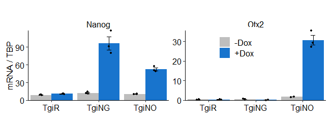

## Differential repression of Otx2 underlies the capacity of NANOG and ESRRB to induce germline entry (Supplementary analysis code)

*Matúš Vojtek, Jingchao Zhang, Juanjuan Sun, Man Zhang and Ian Chambers*

[doi.org/10.1101/2021.06.14.448276](https://doi.org/10.1101/2021.06.14.448276)

------------------------------------------------------------------------

This is a code to reproduce analysis and figures in the manuscript. You can download the data and the code for the analysis either by clicking [here](https://github.com/MatusV8/Otx2het/archive/refs/heads/main.zip), or via bash command line

`git clone https://github.com/MatusV8/Otx2het.git` and reproduce the analysis on your local machine.

The code to reproduce the figures can be seen below.


## Folder structure

- ***Data/*** - all data required for analysis.

- ***Fig/*** - folder where the figures will be saved.

- ***src/*** - Custom R functions.

-   ***Analysis.Rmd*** - Rmarkdown file which contains all code required
    for the analysis.
    
    

## Table of contents

-   [Differential repression of Otx2 underlies the capacity of NANOG and
    ESRRB to induce germline entry (Supplementary analysis
    code)](#differential-repression-of-otx2-underlies-the-capacity-of-nanog-and-esrrb-to-induce-germline-entry-supplementary-analysis-code)
-   [Folder structure](#folder-structure)
-   [Setup](#setup)
-   [Figure 1](#figure-1)
    -   [Figure 1D: Effect of Nanog or Esrrb induction on SSEA1, CD61
        expression](#figure-1d-effect-of-nanog-or-esrrb-induction-on-ssea1-cd61-expression)
    -   [Figure 1E: Effect of Nanog or Esrrb induction on expression of
        PGC markers
        (day 6)](#figure-1e-effect-of-nanog-or-esrrb-induction-on-expression-of-pgc-markers-day-6)
    -   [Figure 1F: Effect of Nanog or Esrrb induction on expression of
        PGC markers (day
        0-2)](#figure-1f-effect-of-nanog-or-esrrb-induction-on-expression-of-pgc-markers-day-0-2)
    -   [Composite figure](#composite-figure)
-   [Figure S1B: Induction levels of *Nanog* and *Esrrb* in TgiN, TgiE
    cells](#figure-s1b-induction-levels-of-nanog-and-esrrb-in-tgin-tgie-cells)
-   [Figure 2](#figure-2)
    -   [Figure 2A: *Otx2* expression after Nanog or Esrrb induction
        (Festuccia et
        al. 2012)](#figure-2a-otx2-expression-after-nanog-or-esrrb-induction-festuccia-et-al.-2012)
    -   [Figure 2B: *Otx2* expression after Nanog or Esrrb induction in
        EpiLCs](#figure-2b-otx2-expression-after-nanog-or-esrrb-induction-in-epilcs)
    -   [Figure 2E: SSEA1 and CD61 induction in TgiN and TgiNO
        cells](#figure-2e-ssea1-and-cd61-induction-in-tgin-and-tgino-cells)
    -   [Composite figures](#composite-figures)
-   [Figure S2: Induction levels of *Nanog* and *Otx2* in TgiNG and
    TgiNO
    cells](#figure-s2-induction-levels-of-nanog-and-otx2-in-tging-and-tgino-cells)
-   [Figure 3](#figure-3)
    -   [Figure 3B: Expression of EpiLC markers in *Otx2<sup>+/-</sup>*
        iN, iE
        EpiLCs](#figure-3b-expression-of-epilc-markers-in-otx2--in-ie-epilcs)
    -   [Figure 3C: Induction of SSEA1 and CD61 in *Otx2<sup>+/-</sup>*
        cells](#figure-3c-induction-of-ssea1-and-cd61-in-otx2--cells)
    -   [Figure 3D: Induction of dPE::GFP reporter in
        *Otx2<sup>+/-</sup>*
        cells](#figure-3d-induction-of-dpegfp-reporter-in-otx2--cells)
    -   [Figure 3E: Expression of PGC markers in *Otx2<sup>+/-</sup>*
        iN, iE
        PGCLCs](#figure-3e-expression-of-pgc-markers-in-otx2--in-ie-pgclcs)
    -   [Composite figures](#composite-figures-1)
-   [Figure S3: Expression at day 2 of PGCLC differentiation
    (*Otx2<sup>+/-</sup>*
    cells)](#figure-s3-expression-at-day-2-of-pgclc-differentiation-otx2--cells)
-   [Session info](#session-info)


## Setup

``` r
library(readr)
library(dplyr)
library(tidyr)
library(ggplot2)
library(RColorBrewer)
library(cowplot)
library(rstatix)

# Set ggplot2 theme
theme_set(theme_classic() +      # Font size 12
            theme(panel.grid.major = element_blank(), # No major grid
                  panel.grid.minor = element_blank(), # No minor grid
                  strip.background = element_blank(), # Remove background
                  legend.key = element_blank(), # Remove White box around legend
                  plot.title = element_text(hjust = 0.5, # Center title
                                            face = "bold",
                                            size = 14), # Title bold
                  plot.subtitle = element_text(hjust = 0.5), # Center subtitle
                  plot.margin = margin(t = 3, r = 3, # Set margins around plots
                                       b = 3, l = 3,
                                       unit = "mm"),
                  legend.key.size = unit(5.6, "mm"),
                  axis.text = element_text(size = 12, color = "black"),
                  axis.title = element_text(size = 13, color = "black"),
                  strip.text.x = element_text(size = 13, color = "black"),
                  legend.text = element_text(size = 13, color = "black"),
                  legend.title = element_text(size = 13, color = "black",
                                              face = "bold"), # Size of legend key
            ))

# Create colour palettes
Blues_pal6 <- brewer.pal(6, "Blues")
Reds_pal6 <- brewer.pal(6, "Reds")
Oranges_pal6 <- brewer.pal(6, "Oranges")
Purples_pal6 <- brewer.pal(6, "Purples")
Dox_cols <- c("gray", "dodgerblue3")

BlueRed_pal6 <- c(Blues_pal6[c(1,3,6)],
                  Reds_pal6[c(1,3,6)])

BlueOrangeRed_pal2 <- c(Blues_pal6[c(3,6)],
                        Oranges_pal6[c(2,4)],
                        Reds_pal6[c(3,6)])

# Import functions
source("src/bargraph_jitter.R")
source("src/bargraph_jitterdodge.R")

# Create output directory for figures
dir.create("Fig")
```

## Figure 1

### Figure 1D: Effect of Nanog or Esrrb induction on SSEA1, CD61 expression

``` r
# load data
TgiNiE_PGCLC_D6 <- read_csv("Data/TgiNiE_PGCLC_D6_SSEA1_CD61.csv")

TgiNiE_PGCLC_D6.p <- TgiNiE_PGCLC_D6 %>%
  separate(Sample, into = c("Cell_line", "Dox"),
           sep = " ") %>%
  mutate(Cell_line = factor(Cell_line, c("TgiN", "TgiE"))) %>%
  bargraph_jitterdodge(x = Cell_line,
                       y = Dbl_pos,
                       group = Dox,
                       ylab = "% SSEA+CD61+ cells",
                       fill_colors = Dox_cols) +
  guides(fill = guide_legend(
    override.aes = list(shape = NA))) +
  labs(fill = element_blank()) +
  theme(legend.position = c(0.15, 0.9))
```

### Figure 1E: Effect of Nanog or Esrrb induction on expression of PGC markers (day 6)

``` r
# Load data
TgiNiE_qPCR_D6 <- read_csv("Data/TgiNiE_PGCLC_D6_qPCR.csv")

# Create plot
TgiNiE_qPCR_D6.p <- TgiNiE_qPCR_D6 %>%
  pivot_longer(cols = Blimp1:Esrrb,
               names_to = "Gene",
               values_to = "Expression") %>%
  filter(Gene %in% c("Ap2r", "Blimp1", "Prdm14")) %>%
  mutate(Sample = factor(
    Sample,
    levels = c("TgiN (D0)",
               "TgiN (D6)",
               "TgiN (D6) +dox",
               "TgiE (D0)",
               "TgiE (D6)",
               "TgiE (D6) +dox")
  )) %>%
  
  bargraph_jitter(x = Sample,
                  y = Expression,
                  group = Sample,
                  ylab = "mRNA / TBP", 
                  fill_colors = BlueRed_pal6) +
  facet_wrap(~ Gene, scales = "free_y") +
  theme(axis.title.x = element_blank(),
        axis.text.x = element_blank(),
        axis.ticks.x = element_blank()
        )
```

### Figure 1F: Effect of Nanog or Esrrb induction on expression of PGC markers (day 0-2)

``` r
# Load data
TgiNiE_timecourse <- read_csv("Data/TgiNiE_timecourse.csv")


TgiNiE_timecourse_PGC.p <- TgiNiE_timecourse %>%
  separate(Sample, into = c("Cell_line", "Dox", "Time"), sep = " ") %>%
  pivot_longer(cols = Blimp1:Nanog,
               names_to = "Gene",
               values_to = "Expression") %>%
  pivot_wider(names_from = Time, values_from = Expression) %>%
  group_by(Cell_line, Dox, Gene) %>% 
  mutate(across(`0h`:`48h`, function(x) log2(x/`0h`))) %>% 
  pivot_longer(cols = `0h`:`48h`, names_to = "Time",
               values_to = "Expression" ) %>%
  filter( Gene %in% c("Ap2g", "Blimp1", "Prdm14")) %>%
  mutate(Time = gsub("h", "", Time) %>% as.numeric(),
         Cell_line = factor(
           Cell_line, levels = c("TgiN", "TgiE"))) %>%
  group_by(Cell_line, Dox, Time, Gene) %>%
  summarise(Mean = mean(Expression),
            SD = sd(Expression)) %>%
  
  ggplot() +
  aes(x = Time, y = Mean,
      group = paste0(Cell_line, Dox),
      color = Cell_line) +
  geom_line(aes( linetype = Dox )) + 
  geom_point(aes(shape = Cell_line)) +
  scale_color_manual(values = BlueRed_pal6[c(3,6)]) +
  scale_linetype_manual(values=c("dashed", "solid")) +
  geom_errorbar(aes(ymin = Mean - SD,
                    ymax = Mean + SD),
                width = 2, size = 0.5) +
  labs(y = expression(log[2] *"(mRNA / 0h)"),
       color = element_blank(),
       shape = element_blank(),
       linetype = element_blank()) +
  scale_x_continuous(name="Time [h]",
                     breaks = seq(0,48,6)) +
  theme(legend.key.size = unit(1, "cm"),
        legend.position = "top",
        legend.justification="right",
        legend.margin=margin(0,0,0,0),
        legend.box.margin=margin(-10,-10,-10,-10),
        axis.text.x = element_text(size = 11)) +
  facet_wrap(~ Gene, nrow = 1, scales = "free")
```

### Composite figure

``` r
f2_patch <- plot_grid(NULL, TgiNiE_PGCLC_D6.p,
                     rel_widths = c(1, 0.9), labels = c("C", "D")) 

plot_grid(NULL, f2_patch, TgiNiE_qPCR_D6.p, TgiNiE_timecourse_PGC.p,
          labels = c("A", "C", "", "F"),
          nrow = 4, rel_heights  = c(30,  55, 49, 62))
```

<!-- -->

``` r
ggsave("Fig/Figure1.pdf", width = 20, height = 25, units = "cm")
```

## Figure S1B: Induction levels of *Nanog* and *Esrrb* in TgiN, TgiE cells

``` r
TgiNiE_timecourse_NanogEsrrb.p <- TgiNiE_timecourse %>%
  separate(Sample, into = c("Cell_line", "Dox", "Time"), sep = " ") %>%
  pivot_longer(cols = Blimp1:Nanog,
               names_to = "Gene",
               values_to = "Expression") %>%
  pivot_wider(names_from = Time, values_from = Expression) %>%
  group_by(Cell_line, Dox, Gene) %>% 
  mutate(across(`0h`:`48h`, function(x) log2(x/`0h`))) %>% 
  pivot_longer(cols = `0h`:`48h`, names_to = "Time",
               values_to = "Expression" ) %>%
  filter( Gene %in% c("Nanog", "Esrrb")) %>%
  mutate(Time = gsub("h", "", Time) %>% as.numeric(),
         Cell_line = factor(Cell_line, levels = c("TgiN", "TgiE")),
         Gene = factor(Gene, levels = c("Nanog", "Esrrb"))) %>%
  group_by(Cell_line, Dox, Time, Gene) %>%
  summarise(Mean = mean(Expression),
            SD = sd(Expression)) %>%
  
  ggplot() +
  aes(x = Time, y = Mean,
      group = paste0(Cell_line, Dox),
      color = Cell_line) +
  geom_line(aes( linetype = Dox )) + 
  geom_point(aes(shape = Cell_line)) +
  scale_color_manual(values = BlueRed_pal6[c(3,6)]) +
  scale_linetype_manual(values=c("dashed", "solid")) +
  geom_errorbar(aes(ymin = Mean - SD,
                    ymax = Mean + SD),
                width = 2, size = 0.5) +
  labs(y = expression(log[2] *"(mRNA / 0h)")) +
  scale_x_continuous(name="Time [h]",
                     breaks = seq(0,48,6)) +
    theme(legend.key.size = unit(1, "cm"),
        legend.position = "top",
        legend.justification="right",
        legend.margin=margin(0,0,0,0),
        legend.box.margin=margin(-10,-10,-10,-10),
        axis.text.x = element_text(size = 11)) +
  facet_wrap(~ Gene, nrow = 1, scales = "free") +
  scale_y_continuous(limits = c(-3, 8))

# Combine figure
plot_grid(NULL, TgiNiE_timecourse_NanogEsrrb.p,
          nrow =2 , labels = c("A", "B"), rel_heights = c(67,63))
```

<!-- -->

``` r
ggsave("Fig/FigureS1.pdf", width = 174, height = 156, units = "mm")
```

## Figure 2

### Figure 2A: *Otx2* expression after Nanog or Esrrb induction (Festuccia et al. 2012)

``` r
# Load data
Festuccia <- read_csv("Data/Otx2_expr_dNiN_dNiE_Festuccia2012.csv")

# Create a plot
Festuccia.p <- Festuccia %>%
  group_by(Cell_line, Time) %>%
  summarise(Mean = mean(Expression),
            SD = sd(Expression)) %>%
  mutate(Cell_line = factor(Cell_line,
                            levels = c("dN iN", "dN iE"))) %>%
  ggplot() +
  aes(x = Time, y = Mean,
      group = Cell_line,
      color = Cell_line) +
  geom_line() + 
  geom_point(aes(shape = Cell_line)) +
  scale_color_manual(values = BlueRed_pal6[c(3,6)]) +
  geom_errorbar(aes(ymin = Mean - SD,
                    ymax = Mean + SD),
                width = 0.5, size = 0.5) +
  labs(y = "Expression\n(normalised tag counts)",
       title = "Otx2 mRNA (ESCs)") +
  scale_x_continuous(name="Time [h]",
                     breaks = c(0,6,12)) +
  theme(legend.position = c(0.2,0.2),
        #legend.key.size = unit(0.4, "cm"),
        legend.background = element_blank())
```

### Figure 2B: *Otx2* expression after Nanog or Esrrb induction in EpiLCs

``` r
# Plot Otx2 response

TgiNiE_timecourse.p <- TgiNiE_timecourse %>%
  select(Sample, Rep, Otx2) %>%
  separate(Sample, into = c("Cell_line", "Dox", "Time"), sep = " ") %>%
  pivot_wider(names_from = Time, values_from = Otx2) %>%
  group_by(Cell_line, Dox) %>% 
  mutate(across(`0h`:`48h`, function(x) log2(x/`0h`))) %>% 
  pivot_longer(cols = `0h`:`48h`,
               names_to = "Time",
               values_to = "Expression") %>%
  mutate(Time = gsub("h", "", Time) %>% as.numeric(),
         Cell_line = factor(Cell_line, levels = c("TgiN", "TgiE"))) %>%
  group_by(Cell_line, Dox, Time) %>%
  summarise(Mean = mean(Expression),
            SD = sd(Expression)) %>%
  ggplot() +
  aes(x = Time, y = Mean,
      group = paste0(Cell_line, Dox),
      color = Cell_line) +
  geom_line(aes( linetype = Dox )) + 
  geom_point(aes(shape = Cell_line)) +
  scale_color_manual(values = BlueRed_pal6[c(3,6)]) +
  scale_linetype_manual(values=c("dashed", "solid")) +
  geom_errorbar(aes(ymin = Mean - SD,
                    ymax = Mean + SD),
                width = 2, size = 0.5) +
  labs(y = expression(log[2] *"(mRNA / 0h)"),
       title = "Otx2 mRNA (EpiLCs)") +
  scale_x_continuous(name="Time [h]", breaks = seq(0,48,6)) +
  theme(legend.key.size = unit(1, "cm")) +
  facet_wrap(~ Cell_line, nrow = 1, scales = "free") + 
  scale_y_continuous(limits = c(-2.25, 2)) +
  theme(
  strip.background = element_blank(),
  strip.text.x = element_blank()
)
```

### Figure 2E: SSEA1 and CD61 induction in TgiN and TgiNO cells

``` r
# Load data

TgiNO_SSEA1CD61 <- read_csv("Data/TgiNG_iNO_PGCLC_D6_SSEA1_CD61.csv")

# TgiN, TgiNO PGCLC D6 SSEA+CD61 % plot

TgiNO_SSEA1CD61.p <- TgiNO_SSEA1CD61 %>%
  mutate(Dox = ifelse(Dox == 0, "-Dox", "+Dox")) %>%
  bargraph_jitterdodge(x = Cell_line,
                       y = Prop_dbl_pos,
                       group = Dox,
                       ylab = "% SSEA+CD61+ cells",
                       fill_colors = Dox_cols) +
  guides(fill = guide_legend(
    override.aes = list(shape = NA))) +
  theme(legend.position = c(0.8,0.8)) +
  labs(fill = element_blank())
```

### Composite figures

``` r
F2_patch1 <- plot_grid(Festuccia.p, TgiNiE_timecourse.p, labels = c("A", "B"),
                   rel_widths = c(0.4, 1))

F2_patch2 <- plot_grid(NULL, NULL, TgiNO_SSEA1CD61.p , nrow = 1,
          labels = c("C", "D", "E"))

plot_grid(F2_patch1, F2_patch2, nrow = 2, rel_heights = c(0.8,1))
```

<!-- -->

``` r
ggsave("Fig/Figure2.pdf", width = 267, height = 165, units = "mm")
```

## Figure S2: Induction levels of *Nanog* and *Otx2* in TgiNG and TgiNO cells

``` r
# load data
TgiNO_valid <- read_csv("Data/TgiNO_ESC_qPCR_validation.csv")

TgiNO_valid %>%
  separate(Sample, into = c("Cell_line", "Dox"), sep = " ") %>%
  mutate(Cell_line = factor(Cell_line,
                            levels = c("TgiR", "TgiNG", "TgiNO"))) %>%
  bargraph_jitterdodge(x = Cell_line,
                       y = Expression,
                       group = Dox, 
                       ylab = "mRNA / TBP",
                       fill_colors = Dox_cols) +
  facet_wrap(~ Gene, scales = "free") +
  guides(fill = guide_legend(
    override.aes = list(shape = NA))) +
  theme(legend.position = c(0.7,0.8)) +
  labs(fill = element_blank())
```

<!-- -->

``` r
ggsave("Fig/FigureS2.pdf", width = 173, height = 63, units = "mm")
```

## Figure 3

### Figure 3B: Expression of EpiLC markers in *Otx2<sup>+/-</sup>* iN, iE EpiLCs

``` r
# Load data
Ohet_EpiLC_qPCR <- read_csv("Data/Otx2Het_iNiE_EpiLC_qPCR.csv")

# Create plot
Ohet_EpiLC_qPCR.p <- Ohet_EpiLC_qPCR %>%
  group_by(Gene) %>%
  mutate(across(starts_with("Otx2"),
                function(x) (x/mean(`Otx2+/+`)))) %>% # Normalise to Tg2a
  pivot_longer(cols = starts_with("Otx2"),
               values_to = "Expression",
               names_to = "Cell_line") %>%
  mutate(Cell_line = factor(Cell_line,
                            levels = c(
                              "Otx2+/+", "Otx2+/- iN c5",
                              "Otx2+/- iE c1", "Otx2+/- iE c10"))) %>%
  bargraph_jitterdodge(x = Gene,
                       y = Expression,
                       group = Cell_line,
                       ylab = "Relative expression",
                       fill_colors = c(
                         "grey",
                         Blues_pal6[6],
                         Oranges_pal6[4],
                         Reds_pal6[6]
                       )) + 
  guides(fill = guide_legend(override.aes = list(shape = NA),
                             ncol = 2)) +
  theme(legend.position = c(0.6,1),
        legend.key.size = unit(0.4, "cm")) +
  labs(fill = element_blank())
```

### Figure 3C: Induction of SSEA1 and CD61 in *Otx2<sup>+/-</sup>* cells

``` r
# Load data
Ohet_PGCLC_FACS <- read_csv("Data/OtxHet_iNiE_PGCLC_D6_SSEA_CD61.csv")

# Create plot
Ohet_PGCLC_FACS.p <- Ohet_PGCLC_FACS %>%
  mutate(Dox = ifelse(Dox == 0, "-Dox", "+Dox"),
         Cell_line = factor(Cell_line,
                            levels = c("iN c5",
                                       "iE c1",
                                       "iE c10"))) %>%
  bargraph_jitterdodge(x = Cell_line,
                       y = Dbl_pos,
                       group = Dox,
                       errorbar = "SEM",
                       fill_colors = Dox_cols) +
  labs(y = "% SSEA1+CD61+ cells",
       fill = element_blank()) +
  guides(fill = guide_legend(
    override.aes = list(shape = NA))) +
  theme(legend.position = c(0.5,0.9),
        legend.key.size = unit(0.4, "cm"),
        legend.direction = "horizontal")
```

### Figure 3D: Induction of dPE::GFP reporter in *Otx2<sup>+/-</sup>* cells

``` r
# Load data
Ohet_PGCLC_dPEGFP <- read_csv("Data/OtxHet_iNiE_PGCLC_D6_dPEGFP.csv")

# Create plot
Ohet_PGCLC_dPEGFP.p <- Ohet_PGCLC_dPEGFP %>%
  mutate(Dox = ifelse(Dox == 0, "-Dox", "+Dox"),
         Cell_line = factor(Cell_line,
                            levels = c("iN c5",
                                       "iE c1",
                                       "iE c10"))) %>%
  bargraph_jitterdodge(x = Cell_line,
                       y = GFP,
                       group = Dox,
                       errorbar = "SEM",
                       fill_colors = Dox_cols) +
  labs(y = "% GFP+ cells",
       fill = element_blank()) +
  guides(fill = guide_legend(
    override.aes = list(shape = NA))) +
  theme(legend.position = c(0.5,0.9),
        legend.key.size = unit(0.4, "cm"),
        legend.direction = "horizontal")
```

### Figure 3E: Expression of PGC markers in *Otx2<sup>+/-</sup>* iN, iE PGCLCs

``` r
# Load data
Ohet_PGCLC_qPCR <- read_csv("Data/OtxHet_iNiE_PGCPC_D6_qPCR.csv")

# Create plot

Ohet_PGCLC_qPCR.p <- Ohet_PGCLC_qPCR %>%
  mutate(Sample = factor(
    Sample,
    levels = c("iN -Dox",
               "iN +Dox",
               "iEc1 -Dox",
               "iEc1 +Dox",
               "iEc10 -Dox",
               "iEc10 +Dox")
  )) %>%
  bargraph_jitter(x = Sample,
                  y = Expression,
                  group = Sample,
                  ylab = "mRNA / TBP",
                  fill_colors = BlueOrangeRed_pal2) +
  facet_wrap(~ Gene,
             scales = "free", strip.position="bottom") +
  theme(axis.title.x = element_blank(),
        axis.text.x = element_blank(),
        axis.ticks.x = element_blank(),
        legend.key.size = unit(0.4, "cm"),
        strip.placement = "outside",
        legend.position = "top") +
  guides(fill=guide_legend(ncol=3)) +
  labs(fill = element_blank())
```

### Composite figures

``` r
plot_grid(
  plot_grid(NULL, Ohet_EpiLC_qPCR.p, labels = c("A", "B")),
  plot_grid(Ohet_PGCLC_FACS.p, Ohet_PGCLC_dPEGFP.p, labels = c("C", "D")),
  plot_grid(Ohet_PGCLC_qPCR.p,labels = c("E")),
  nrow = 3, rel_heights = c(63, 58, 65))
```

<!-- -->

``` r
ggsave("Fig/Figure3.pdf", width = 188, height = 200, units = "mm")
```

## Figure S3: Expression at day 2 of PGCLC differentiation (*Otx2<sup>+/-</sup>* cells)

``` r
# Load data
OHet_qPCR_D2 <- read_csv("Data/Otx2Het_iNiE_GK15_D2_qPCR.csv")

# Create plot
OHet_qPCR_D2 %>%
  pivot_wider(names_from = "Sample", values_from = "Expression") %>%
  group_by(Gene) %>%
  mutate(
    across(`Tg2a -Dox`:`iEc10 +Dox`,
           function(x) (x/mean(`Tg2a +Dox`) # Normalise to Tg2a +Dox sample
           ))) %>% 
  pivot_longer(cols = `Tg2a -Dox`:`iEc10 +Dox`,
               values_to = "Expression",
               names_to = "Sample") %>%
  mutate(Sample = factor(
    Sample,
    levels = c("Tg2a -Dox",
               "Tg2a +Dox",
               "iN -Dox",
               "iN +Dox",
               "iEc1 -Dox",
               "iEc1 +Dox",
               "iEc10 -Dox",
               "iEc10 +Dox")),
    Gene = factor(
      Gene,
      levels = c("Nanog", "Esrrb", "Ap2r", "Blimp1", "Prdm14"))
  ) %>%
  bargraph_jitter(x = Sample,
                  y = Expression,
                  group = Sample,
                  ylab = "Relative expression",
                  fill_colors = c("gray60", "gray40", BlueOrangeRed_pal2)) +
  facet_wrap(~ Gene,
             scales = "free", strip.position="bottom", nrow = 1) +
  theme(axis.title.x = element_blank(),
        axis.text.x = element_blank(),
        axis.ticks.x = element_blank(),
        legend.key.size = unit(0.4, "cm"),
        strip.placement = "outside",
        legend.position = "top") +
  guides(fill=guide_legend(ncol=4)) +
  labs(fill = element_blank())
```

<!-- -->

``` r
ggsave("Fig/FigureS3.pdf", width = 19.9, height = 9, units = "cm")
```

## Session info

``` r
sessionInfo()
```

    ## R version 4.0.3 (2020-10-10)
    ## Platform: x86_64-w64-mingw32/x64 (64-bit)
    ## Running under: Windows 10 x64 (build 19041)
    ## 
    ## Matrix products: default
    ## 
    ## locale:
    ## [1] LC_COLLATE=English_United Kingdom.1252 
    ## [2] LC_CTYPE=English_United Kingdom.1252   
    ## [3] LC_MONETARY=English_United Kingdom.1252
    ## [4] LC_NUMERIC=C                           
    ## [5] LC_TIME=English_United Kingdom.1252    
    ## 
    ## attached base packages:
    ## [1] stats     graphics  grDevices utils     datasets  methods   base     
    ## 
    ## other attached packages:
    ## [1] rstatix_0.7.0      cowplot_1.1.1      RColorBrewer_1.1-2 ggplot2_3.3.3     
    ## [5] tidyr_1.1.2        dplyr_1.0.3        readr_1.4.0       
    ## 
    ## loaded via a namespace (and not attached):
    ##  [1] tidyselect_1.1.0  xfun_0.20         purrr_0.3.4       haven_2.3.1      
    ##  [5] carData_3.0-4     colorspace_2.0-0  vctrs_0.3.6       generics_0.1.0   
    ##  [9] htmltools_0.5.1.1 yaml_2.2.1        rlang_0.4.10      pillar_1.4.7     
    ## [13] foreign_0.8-81    glue_1.4.2        withr_2.4.1       DBI_1.1.1        
    ## [17] readxl_1.3.1      lifecycle_0.2.0   stringr_1.4.0     munsell_0.5.0    
    ## [21] gtable_0.3.0      cellranger_1.1.0  zip_2.1.1         evaluate_0.14    
    ## [25] labeling_0.4.2    knitr_1.31        rio_0.5.16        forcats_0.5.1    
    ## [29] curl_4.3          highr_0.8         broom_0.7.4       Rcpp_1.0.6       
    ## [33] backports_1.2.1   scales_1.1.1      abind_1.4-5       farver_2.0.3     
    ## [37] hms_1.0.0         digest_0.6.27     stringi_1.5.3     openxlsx_4.2.3   
    ## [41] grid_4.0.3        cli_2.3.0         tools_4.0.3       magrittr_2.0.1   
    ## [45] tibble_3.0.5      crayon_1.4.1      car_3.0-10        pkgconfig_2.0.3  
    ## [49] ellipsis_0.3.1    data.table_1.13.6 assertthat_0.2.1  rmarkdown_2.6    
    ## [53] rstudioapi_0.13   R6_2.5.0          compiler_4.0.3